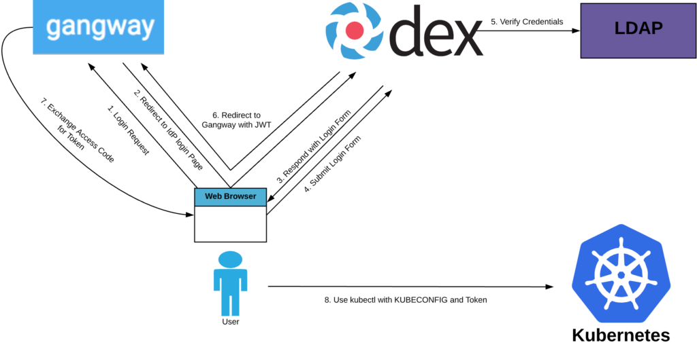

# LDAP Authentication with Gangway and Dex for Kubernetes

Using Gangway and Dex for Kubernetes Authentication with Active Directory. 

## Architecture

The following diagram shows a high-level architecture of the system.



## Prerequisites

- Admin access to a Kubernetes cluster
- Ability to add DNS entries for a domain you control.
- Access to make changes to Active Directory Users/Groups
- Active Directory server connection information
- [Cert-manager](https://github.com/jetstack/cert-manager) deployed and issuers ready to create certs for Dex/Gangway
- An Ingress Controller configured
- A load balancer configured to route traffic to the ingress controller
- Two DNS Records configured to direct traffic to the load balancer. - dex.${DNS_NAME} and gangway.${DNS_NAME}
- The AD Users that will access the Kubernetes cluster must have an email field populated in AD.


## Components

We will use the following components:

- [gangway](https://github.com/heptiolabs/gangway): OIDC client application
- [dex](https://github.com/coreos/dex): OIDC provider
- Active Directory: Identity store

## Steps

### Generate OIDC client secret

Gangway and dex need to be configured with a shared secret.

Generate the secret:

```sh
openssl rand -base64 32
```

You will input this secret in gangway and dex's configuration files.

### Deploy Dex

#### Update config

The following table describes placeholders that must be updated before deploying dex.

*Important: Each placeholder can show up multiple times in the same document. Make sure to update all ocurrences.*

| Placeholder | Description |
|----|-------|
| `${DNS_NAME}` | Update the placeholder with the domain that you own. For example, if you own `example.com`, the value of issuer should be `https://dex.example.com/dex` |
| `${OIDC_CLIENT_SECRET}` | This is the secret that was generated before |
| `${DEX_STATIC_ADMIN_PASSWORD_HASH}` | The bcrypt hash of the password you want to use for the admin user |
| `${AD_HOST/PORT}` | The hostname of the ldap server and the port. Example ad01.domain.local:389 |
| `${BIND_USER_DN}` | The bindDN of a user with read access to AD. Format: CN=binduser,cn=users,dc=domain,dc=local |
| `${BIND_PASSWORD}` | The password for the bind account |
| `${BASE_USER_SEARCH_DN}` | The distinguished name of a directory to search for AD Users. Format: dc=domain,dc=local|
| `${BASE_GROUP_SEARCH_DN}` | The distinguished name of a directory to search for AD groups. Format: dc=domain,dc=local |


Update the following files before deploying:

- dex/01-configmap.yaml
- dex/03-ingress.yaml

#### Deploy

Once the placeholders have been updated, deploy dex:

```sh
# This command will make sure that you have updated the placeholders
grep -r '\${' ./dex || kubectl apply -f ./dex
```

### Deploy Gangway

#### Update config

The following table describes placeholders that must be updated before deploying dex.

*Important: Each placeholder can show up multiple times in the same document. Make sure to update all ocurrences.*

| Placeholder | Description |
|----|-------|
| `${CLUSTER_NAME}` | The name of your cluster. This is mainly for display purposes |
| `${DNS_NAME}` | Update the placeholder with the domain that you own. For example, if you own `example.com`, the value of issuer should be `https://dex.example.com/dex` |
| `${OIDC_CLIENT_SECRET}` | This is the secret that was generated before |
| `${KUBERNETES_APISERVER_URL}` | The address of the API server |

Update the following files before deploying:

- gangway/01-configmap.yaml
- gangway/03-ingress.yaml

#### Create secret

Create the gangway cookies that are used to encrypt gangway cookies:

```sh
kubectl -n gangway create secret generic gangway-key \
  --from-literal=sesssionkey=$(openssl rand -base64 32)
```

#### Deploy

Once the placeholders have been updated, deploy:

```sh
# This command will make sure that you have updated the placeholders
grep -r '\${' ./gangway || kubectl apply -f ./gangway
```

### Configure API server

Add the following flags to your API server configuration:

```yaml
- --oidc-issuer-url=https://dex.<enter your domain here>/dex
- --oidc-client-id=gangway
- --oidc-username-claim=email
- --oidc-groups-claim=groups
```

## Authenticate

Once all components are up and running, you should be able to obtain credentials for your cluster using a browser to access gangway at `https://gangway.${DNS_NAME}`.
